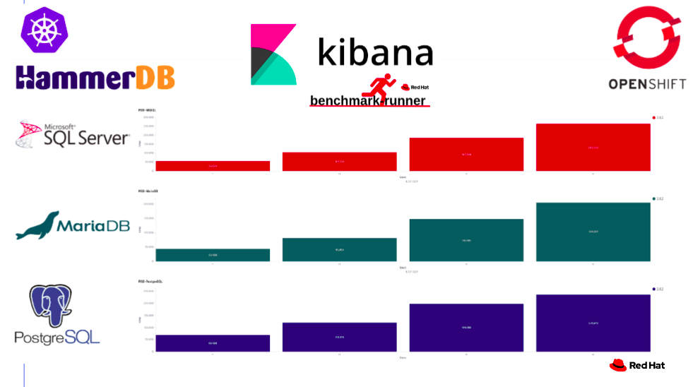
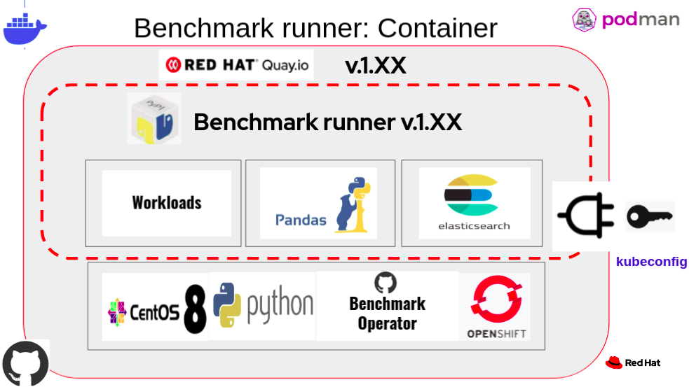

[](https://github.com/redhat-performance/benchmark-runner/actions)
[](https://coveralls.io/github/redhat-performance/benchmark-runner?branch=main)

# Benchmark-Runner

This tool provides a lightweight and flexible framework for running benchmark workloads 
on Kubernetes/OpenShift Pod or VM.

This tool support the following workloads:

* [hammerdb](https://hammerdb.com/): running hammerdb workload on the following databases: MSSQL, Mariadb, Postgresql on Pod and VM with [Configuration](benchmark_runner/benchmark_operator/templates/hammerdb)
* [stressng](https://wiki.ubuntu.com/Kernel/Reference/stress-ng): running stressng workload on Pod or VM with [Configuration](benchmark_runner/benchmark_operator/templates/stressng)
* [uperf](http://uperf.org/): running uperf workload on Pod or VM with [Configuration](benchmark_runner/benchmark_operator/templates/uperf)

** First Phase: supports [benchmark-operator workloads](https://github.com/cloud-bulldozer/benchmark-operator)

Hammerdb Kibana dashboard:


Reference:
* The benchmark-runner package is located in [PyPi](https://pypi.org/project/benchmark-runner)
* The benchmark-runner container image is located in [Quay.io](https://quay.io/repository/ebattat/benchmark-runner)



_**Table of Contents**_

<!-- TOC -->
- [Run workload using Podman or Docker](#run-workload-using-podman-or-docker)
- [Run workload in Pod using Kubernetes or OpenShift](#run-workload-in-pod-using-kubernetes-or-openshift)
<!-- /TOC -->

## Run workload using Podman or Docker 

#### Environment variables description:

**mandatory:** KUBEADMIN_PASSWORD=$KUBEADMIN_PASSWORD

**mandatory:** WORKLOAD=$WORKLOAD

Choose one from the following list:

`['stressng_pod', 'stressng_vm','uperf_pod', 'uperf_vm', 'hammerdb_pod_mariadb', 'hammerdb_pod_mssql', 'hammerdb_pod_postgres', 'hammerdb_vm_mariadb', 'hammerdb_vm_mssql', 'hammerdb_vm_postgres']`

**auto:** NAMESPACE=benchmark-operator [ The default namespace is benchmark-operator ]

**auto:** OCS_PVC=true [ The default is used OCS PVC ]

**auto:** RUNNER_PATH=/ [ The default work space is / ]

**optional:** PIN_NODE_BENCHMARK_OPERATOR=$PIN_NODE_BENCHMARK_OPERATOR [node selector for benchmark operator pod]

**optional:** PIN_NODE1=$PIN_NODE1 [node1 selector for running the workload]

**optional:** PIN_NODE2=$PIN_NODE2 [node2 selector for running the workload, i.e. uperf server and client, hammerdb database and workload]

**optional:** ELASTICSEARCH=$ELASTICSEARCH [ elasticsearch service name]

**optional:** ELASTICSEARCH_PORT=$ELASTICSEARCH_PORT

```sh
podman run --rm -e WORKLOAD=$WORKLOAD -e KUBEADMIN_PASSWORD=$KUBEADMIN_PASSWORD -e PIN_NODE_BENCHMARK_OPERATOR=$PIN_NODE_BENCHMARK_OPERATOR -e PIN_NODE1=$PIN_NODE1 -e PIN_NODE2=$PIN_NODE2 -e ELASTICSEARCH=$ELASTICSEARCH -e ELASTICSEARCH_PORT=$ELASTICSEARCH_PORT -e log_level=INFO -v $KUBECONFIG:/root/.kube/config --privileged quay.io/ebattat/benchmark-runner:latest

# For custom workload data configuration add:
-v /home/user/stressng/stressng_data.yaml:/benchmark_runner/benchmark_operator/template/stressng/stressng_data.yaml
```


## Run workload in Pod using Kubernetes or OpenShift

[TBD]

