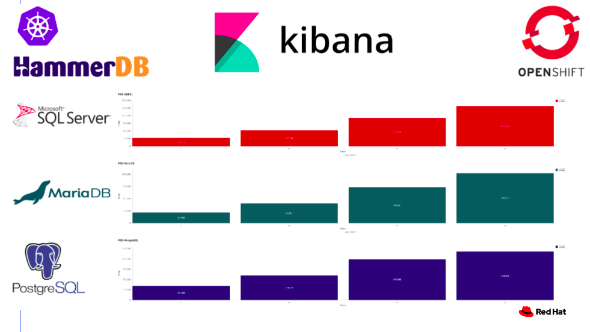

[](https://github.com/redhat-performance/benchmark-runner/actions)
[](https://coveralls.io/github/redhat-performance/cloud-governance?branch=master)

<h3 align="center">Benchmark-Runner </h3>

This tool provides a lightweight and flexible framework for running benchmark workloads 
on Kubernetes/OpenShift Pod or VM.

This tool support the following workloads:

* [hammerdb](https://hammerdb.com/): running hammerdb workload on the following databases: MSSQL, Mariadb, Postgresql on Pod and VM with [Configuration](benchmark_runner/benchmark_operator/templates/hammerdb)
* [stressng](https://wiki.ubuntu.com/Kernel/Reference/stress-ng): running stressng workload on Pod or VM with [Configuration](benchmark_runner/benchmark_operator/templates/stressng)
* [uperf](http://uperf.org/): running uperf workload on Pod or VM with [Configuration](benchmark_runner/benchmark_operator/templates/uperf)

** First Phase: support [benchmark-operator workloads](https://github.com/cloud-bulldozer/benchmark-operator)

Hammerdb Kibana dashboard:


Reference:
* The benchmark-runner package is located in [PyPi](https://pypi.org/project/benchmark-runner)
* The benchmark-runner container image is located in [Quay.io](https://quay.io/repository/ebattat/benchmark-runner)


_**Table of Contents**_

<!-- TOC -->
- [Installation](#installation)
- [Run workload using Docker/Podman](#run-policy-using-docker-podman)
- [Run workload in Pod using Kubernetes/OpenShift](#run-policy-using-pod)
- [Post Installation](#post-installation)

<!-- /TOC -->

## Installation

#### Download benchmark-runner image from quay.io
```sh
sudo podman pull quay.io/ebattat/benchmark-runner:latest
```

#### Environment variables description:

`mandatory:`KUBEADMIN_PASSWORD=$kubeadmin_password

`mandatory:`WORKLOAD=$workload

Choose one from the following list:

`['stressng_pod', 'stressng_vm','uperf_pod', 'uperf_vm', 'hammerdb_pod_mariadb', 'hammerdb_pod_mssql', 'hammerdb_pod_postgres', 'hammerdb_vm_mariadb', 'hammerdb_vm_mssql', 'hammerdb_vm_postgres']`

`mandatory:`ELASTICSEARCH=$elasticsearch  # IP

`mandatory:`ELASTICSEARCH_PORT=$elasticsearch_port

`optional:`PIN_NODE1=$pin_node1

`optional:`PIN_NODE2=$pin_node2

## Run workload using Podman/Docker 
```sh
sudo podman run --rm -it -e WORKLOAD=stressng_pod -e KUBEADMIN_PASSWORD=$kubeadmin_password -e ELASTICSEARCH=$elasticsearch -e ELASTICSEARCH_PORT=$elasticsearch_port -e PIN_NODE1=$pin_node1 -v /root/.kube/config:/root/.kube/config -e log_level=INFO --privileged quay.io/ebattat/benchmark-runner:latest

# For custom workload data configuration add:
-v /home/user/stressng/stressng_data.yaml:/benchmark_runner/benchmark_operator/template/stressng/stressng_data.yaml
```

## Run workload in Pod using Kubernetes/OpenShift

[TBD]

## Post Installation

#### Delete benchmark-runner image
```sh
sudo podman rmi quay.io/ebattat/benchmark-runner:latest
```
