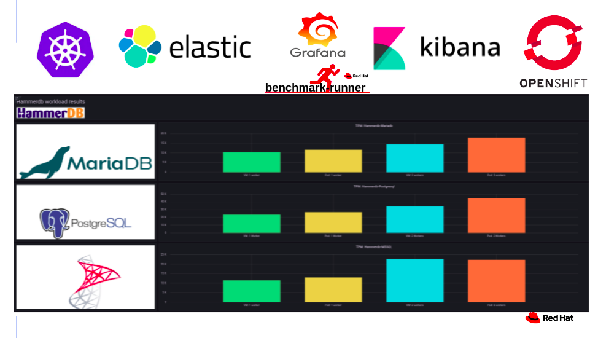
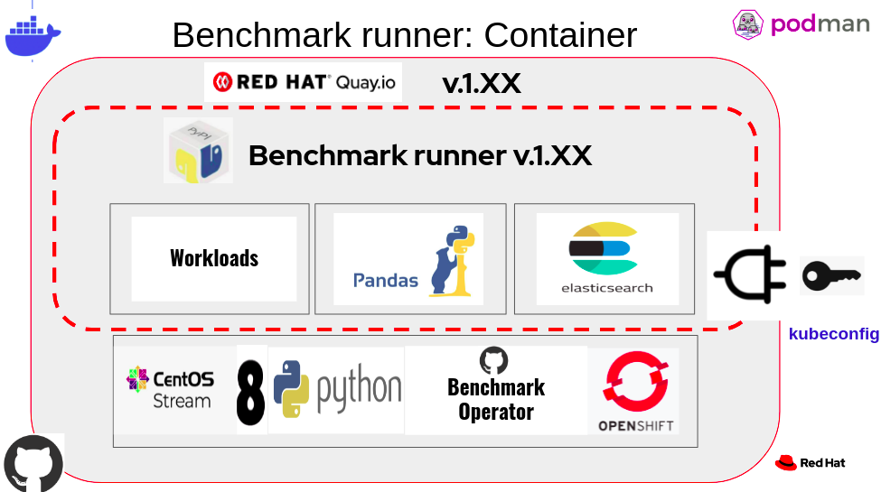
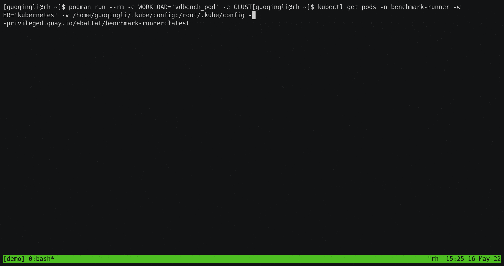
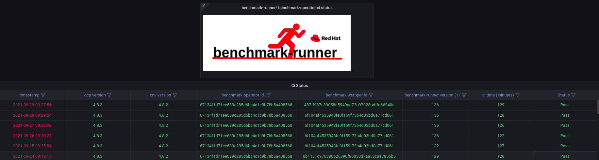
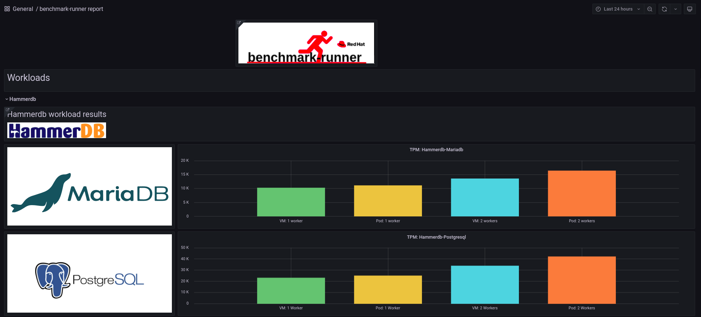

<div align="center">
  <br>
</div>

-----------------

# Benchmark-Runner: Running benchmarks
[](https://github.com/redhat-performance/benchmark-runner/actions)
[](https://pypi.org/project/benchmark-runner/)
[](https://quay.io/repository/ebattat/benchmark-runner?tab=tags)
[](https://coveralls.io/github/redhat-performance/benchmark-runner?branch=main&kill_cache=1)
[](https://benchmark-runner.readthedocs.io/en/latest/?badge=latest)
[](https://pypi.org/project/benchmark-runner)
[](https://github.com/redhat-performance/benchmark-runner/blob/main/LICENSE)

## What is it?

**benchmark-runner** is a containerized Python lightweight and flexible framework for running benchmark workloads
on Kubernetes/OpenShift runtype kinds Pod, kata and VM.

This framework support the following embedded workloads:

* [hammerdb](https://hammerdb.com/): running hammerdb workload on the following databases: MSSQL, Mariadb, Postgresql in Pod, Kata or VM with [Configuration](benchmark_runner/templates/hammerdb)
* [stressng](https://wiki.ubuntu.com/Kernel/Reference/stress-ng): running stressng workload in Pod, Kata or VM [Configuration](benchmark_runner/templates/stressng)
* [uperf](http://uperf.org/): running uperf workload in Pod, Kata or VM with [Configuration](benchmark_runner/templates/uperf)
* [vdbench](https://wiki.lustre.org/VDBench/): running vdbench workload in Pod, Kata or VM with [Configuration](benchmark_runner/templates/vdbench)

Benchmark-runner grafana dashboard example:


Reference:
* The benchmark-runner package is located in [PyPi](https://pypi.org/project/benchmark-runner)
* The benchmark-runner container image is located in [Quay.io](https://quay.io/repository/ebattat/benchmark-runner)

## Documentation
Documentation is available at [benchmark-runner.readthedocs.io](https://benchmark-runner.readthedocs.io/en/latest/)



_**Table of Contents**_

<!-- TOC -->
- [Benchmark-Runner](#benchmark-runner)
  - [Documentation](#documentation)
  - [Run workload using Podman or Docker](#run-workload-using-podman-or-docker)
  - [Run workload in Pod using Kubernetes or OpenShift](#run-workload-in-pod-using-kubernetes-or-openshift)
  - [Grafana dashboards](#grafana-dashboards)
  - [Inspect Prometheus Metrics](#inspect-prometheus-metrics)
  - [How to develop in benchmark-runner](#how-to-develop-in-benchmark-runner)

<!-- /TOC -->

## Run workload using Podman or Docker

The following options may be passed via command line flags or set in the environment:

**mandatory:** WORKLOAD=$WORKLOAD

Choose one from the following list:

`['stressng_pod', 'stressng_vm', 'stressng_kata', 'uperf_pod', 'uperf_vm', 'uperf_kata', 'hammerdb_pod_mariadb', 'hammerdb_vm_mariadb', 'hammerdb_kata_mariadb', 'hammerdb_pod_mariadb_lso', 'hammerdb_vm_mariadb_lso', 'hammerdb_kata_mariadb_lso', 'hammerdb_pod_postgres', 'hammerdb_vm_postgres', 'hammerdb_kata_postgres', 'hammerdb_pod_postgres_lso', 'hammerdb_vm_postgres_lso', 'hammerdb_kata_postgres_lso', 'hammerdb_pod_mssql', 'hammerdb_vm_mssql', 'hammerdb_kata_mssql', 'hammerdb_pod_mssql_lso', 'hammerdb_vm_mssql_lso', 'hammerdb_kata_mssql_lso', 'vdbench_pod', 'vdbench_kata', 'vdbench_vm', 'clusterbuster']`

** clusterbuster workloads: cpusoaker, files, fio, uperf. for more details [see](https://github.com/RobertKrawitz/OpenShift4-tools)

**auto:** NAMESPACE=benchmark-operator [ The default namespace is benchmark-operator ]

**auto:** ODF_PVC=True [ True=ODF PVC storage, False=Ephemeral storage, default True ]

**auto:** EXTRACT_PROMETHEUS_SNAPSHOT=True [ True=extract Prometheus snapshot into artifacts, false=don't, default True ]

**auto:** SYSTEM_METRICS=True [ True=collect metric, False=not collect metrics, default True ]

**auto:** RUNNER_PATH=/tmp [ The default work space is /tmp ]

**optional:** KUBEADMIN_PASSWORD=$KUBEADMIN_PASSWORD

**optional:** PIN_NODE_BENCHMARK_OPERATOR=$PIN_NODE_BENCHMARK_OPERATOR [node selector for benchmark operator pod]

**optional:** PIN_NODE1=$PIN_NODE1 [node1 selector for running the workload]

**optional:** PIN_NODE2=$PIN_NODE2 [node2 selector for running the workload, i.e. uperf server and client, hammerdb database and workload]

**optional:** ELASTICSEARCH=$ELASTICSEARCH [ elasticsearch service name]

**optional:** ELASTICSEARCH_PORT=$ELASTICSEARCH_PORT

**optional:** CLUSTER=$CLUSTER [ set CLUSTER='kubernetes' to run workload on a kubernetes cluster, default 'openshift' ]

**optional:** SCALE=SCALE [For Vdbench only: Scale in each node]

**optional:** SCALE_NODES=SCALE_NODES [For Vdbench only: Scale's node]

**optional:** REDIS=REDIS [For Vdbench only: redis for scale synchronization]

For example:

```sh
podman run --rm -e log_level=INFO -v $KUBECONFIG:/root/.kube/config --privileged quay.io/ebattat/benchmark-runner:lateste --workload=$WORKLOAD --kubeadmin-password=$KUBEADMIN_PASSWORD --pin-node-benchmark-operator=$PIN_NODE_BENCHMARK_OPERATOR --pin-node1=$PIN_NODE1 --pin-node2=$PIN_NODE2 --elasticsearch=$ELASTICSEARCH --elasticsearch-port=$ELASTICSEARCH_PORT
```
or
```sh
podman run --rm -e WORKLOAD=$WORKLOAD -e KUBEADMIN_PASSWORD=$KUBEADMIN_PASSWORD -e PIN_NODE_BENCHMARK_OPERATOR=$PIN_NODE_BENCHMARK_OPERATOR -e PIN_NODE1=$PIN_NODE1 -e PIN_NODE2=$PIN_NODE2 -e ELASTICSEARCH=$ELASTICSEARCH -e ELASTICSEARCH_PORT=$ELASTICSEARCH_PORT -e log_level=INFO -v $KUBECONFIG:/root/.kube/config --privileged quay.io/ebattat/benchmark-runner:latest
```
SAVE RUN ARTIFACTS LOCAL:
1. add `-e SAVE_ARTIFACTS_LOCAL='True'` or `--save-artifacts-local=true`
2. add `-v /tmp:/tmp`
3. git clone https://github.com/cloud-bulldozer/benchmark-operator /tmp/benchmark-operator

### Run vdbench workload in Pod using OpenShift


### Run vdbench workload in Pod using Kubernetes


## Run workload in Pod using Kubernetes or OpenShift

[TBD]

## Grafana dashboards

There are 3 grafana dashboards templates:
1. [benchmark-runner-ci-status-report.json](grafana/benchmark-runner-ci-status-report.json)
   
2. [benchmark-runner-report.json](grafana/benchmark-runner-report.json)
   

** After importing json in grafana, you need to configure elasticsearch data source. (for more details: see [HOW_TO.md](HOW_TO.md))

## Inspect Prometheus Metrics

The CI jobs store snapshots of the Prometheus database for each run as part of the artifacts.  Within the artifact directory is a Prometheus snapshot directory named:

```
promdb-YYYY_MM_DDTHH_mm_ss+0000_YYYY_MM_DDTHH_mm_ss+0000.tar
```

The timestamps are for the start and end of the metrics capture; they
are stored in UTC time (`+0000`).  It is possible to run containerized
Prometheus on it to inspect the metrics.  *Note that Prometheus
requires write access to its database, so it will actually write to
the snapshot.* So for example if you have downloaded artifacts for a
run named `hammerdb-vm-mariadb-2022-01-04-08-21-23` and the Prometheus
snapshot within is named
`promdb_2022_01_04T08_21_52+0000_2022_01_04T08_45_47+0000`, you could run as follows:

```
$ local_prometheus_snapshot=/hammerdb-vm-mariadb-2022-01-04-08-21-23/promdb_2022_01_04T08_21_52+0000_2022_01_04T08_45_47+0000
$ chmod -R g-s,a+rw "$local_prometheus_snapshot"
$ sudo podman run --rm -p 9090:9090 -uroot -v "$local_prometheus_snapshot:/prometheus" --privileged prom/prometheus --config.file=/etc/prometheus/prometheus.yml --storage.tsdb.path=/prometheus --storage.tsdb.retention.time=100000d --storage.tsdb.retention.size=1000PB
```

and point your browser at port 9090 on your local system, you can run queries against it, e.g.

```
sum(irate(node_cpu_seconds_total[2m])) by (mode,instance) > 0
```

It is important to use the `--storage.tsdb.retention.time` option to
Prometheus, as otherwise Prometheus may discard the data in the
snapshot.  And note that you must set the time bounds on the
Prometheus query to fit the start and end times as recorded in the
name of the promdb snapshot.

## How to develop in benchmark-runner

see [HOW_TO.md](HOW_TO.md)
